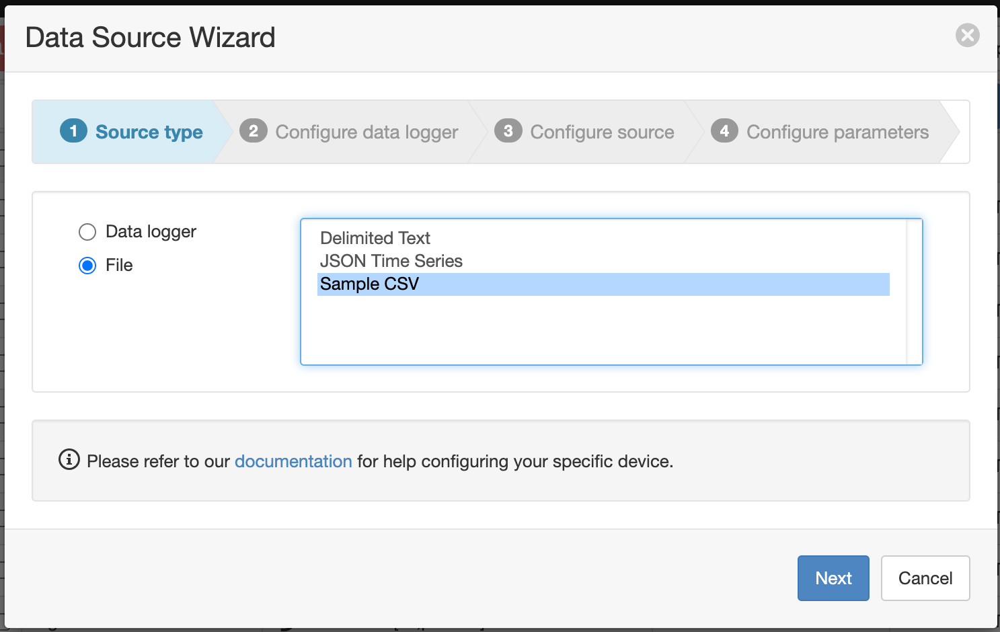

# Contributing a converter

A `converter` for a specific *format* can be contributed as a [Pull Request](https://docs.github.com/en/pull-requests) to this repository and should consist of three files:

| File | Description |
|------|-------------|
| `lib/{format}/{format}-converter.ts` | a [TypeScript](https://www.typescriptlang.org) class that extends [Converter](converter.ts); bytes are supplied to the `convert` function as a `Buffer`, transformed by your code, and returned as a [JtsDocument](https://github.com/eagle-io/timeseries#jts-document) (aided by the [@eagle-io/timeseries](https://github.com/eagle-io/timeseries) library) |
| `lib/{format}/test/input.dat` | an example of the format to be transformed; may consist of binary or text data |
| `lib/{format}/test/{format}-converter.test.ts` | one or more unit tests that prove your `converter` faithfully transforms input to [JSON Time Series](https://docs.eagle.io/en/latest/reference/historic/jts.html) format |

NOTE: The `{format}` name you choose should describe the service or device that produces the data being converted.

Two working examples are provided and can be a good starting point for your `converter`:

- `sample-converter` converts CSV data using the timezone embedded in each record timestamp
- `sample-with-zone-converter` converts CSV data using the timezone configured on your Data Source (useful when your data does not specify a timezone)

Once your `converter` has been submitted and approved, your format will be visible in the Data Source wizard.

### Required tools
- Git
- Node.js 16.x

### Getting started
- [Fork](https://github.com/eagle-io/converter/fork) this repository
- Clone your fork locally
- Run `npm install` to ensure all packages are available

### Submitting a converter
- Run `npm run test` and ensure all tests pass
- Ensure file and class names match existing convention
- Commit and push your changes
- Submit a [Pull Request](https://github.com/eagle-io/converter/compare)
- Wait for eagle.io to review your submission
